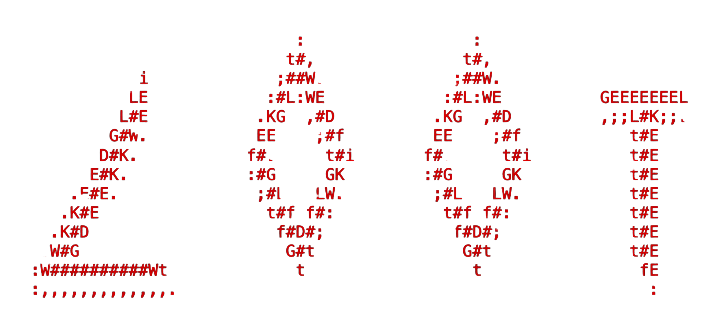

<div align="center">

# L0WK3Y's Offensive Operations Toolkit (LOOT)



[](https://python.org)
[](LICENSE)
[]()

[]()
[]()
[]()
[![AI/LLM](https://img.shields.io/badge/AI%2FLLM-Security-purple?style=for-the-badge&logo=data:image/svg+xml;base64,PHN2ZyB4bWxucz0iaHR0cDovL3d3dy53My5vcmcvMjAwMC9zdmciIHZpZXdCb3g9IjAgMCAyNTYgMjYwIiBmaWxsPSJ3aGl0ZSI+PHBhdGggZD0iTTIzOS4xODQgMTA2LjIwM2E1NC41MiA1NC41MiAwIDAgMC01LjU3Ni01MS4xMDMgNTUuNDgyIDU1LjQ4MiAwIDAgMC03MC4zOTQtMTkuMzYgNTQuNjA4IDU0LjYwOCAwIDAgMC02Mi4zMjQtMTkuODAyIDU0LjUzNSA1NC41MzUgMCAwIDAtNDguNzc1IDQzLjgwMiA1NC4zNSA1NC4zNSAwIDAgMC00My4yMyAzMS4zNjEgNTUuNTM0IDU1LjUzNCAwIDAgMCA4LjM2NCA2Mi4yOTggNTQuNTIgNTQuNTIgMCAwIDAgNS41NzYgNTEuMTAzIDU1LjQ4MiA1NS40ODIgMCAwIDAgNzAuMzk0IDE5LjM2IDU0LjYwOCA1NC42MDggMCAwIDAgNjIuMzI0IDE5LjgwMiA1NC41MzUgNTQuNTM1IDAgMCAwIDQ4Ljc3NS00My44MDIgNTQuMzUgNTQuMzUgMCAwIDAgNDMuMjMtMzEuMzYxIDU1LjUzNCA1NS41MzQgMCAwIDAtOC4zNjQtNjIuMjk4em0tMTA0LjU2IDEzNi4zMzhhNDEuMDM2IDQxLjAzNiAwIDAgMS0zMS4xMDUtMTEuMjU1bDEuNTM1LS44NyA1MS42Ny0yOS44MjVhOC41OTUgOC41OTUgMCAwIDAgNC4yNDctNy4zNjd2LTcyLjg1bDIxLjg0NSAxMi42MzZjLjIxOC4xMTEuMzcuMzIuNDA5LjU2MnY2MC4zNjdjLS4wNTYgMjYuODE4LTIxLjc4MyA0OC41NDUtNDguNjAxIDQ4LjYwMnpNMzcuMTU4IDE5Ny45M2E0MC45NDYgNDAuOTQ2IDAgMCAxLTUuNzgyLTMyLjU4OGwxLjUzNS45MjEgNTEuNzIxIDI5LjgyNmE4LjMzOSA4LjMzOSAwIDAgMCA4LjQ0MSAwbDYzLjE4MS0zNi40MjV2MjUuMjIxYy0uMDEyLjI2NS0uMTQ0LjUxLS4zNTcuNjY2bC01Mi4zMzYgMzAuMTg0Yy0yMy4yNTYgMTMuMzk4LTUyLjk2OSA1LjQzMS02Ni40MDMtMTcuODA1ek0yMy41NSA4NS4zOGE0MC45MDEgNDAuOTAxIDAgMCAxIDI1LjU4LTIxLjMzM3Y2MS4zOWE4LjI4OCA4LjI4OCAwIDAgMCA0LjE5NSA3LjMxNmw2My4wNyAzNi4yNzItMjEuODQ1IDEyLjYzNmEuNDg4LjQ4OCAwIDAgMS0uNzY3LS4xMjRMNDEuMzUzIDE1MS41M0MxOC4xNDIgMTM4LjA3NiAxMC4xODIgMTA4LjM4NSAyMy41NSA4NS4xMjV6bTE3OS40NjYgNDEuNjk1bC02My4wOC0zNi42MyAyMS44NDUtMTIuNTg0YS40ODguNDg4IDAgMCAxIC43NjcuMTI0bDUyLjQzIDMwLjE1NmMxNi4zMDIgOS40MDcgMjUuNzA3IDI3LjM4MiAyNC4xNDEgNDYuMTM4LTEuNTY2IDE4Ljc1Ny0xMy44MjEgMzQuOTIzLTMxLjQ1NyA0MS40OTd2LTYxLjQyM2MtLjA5Mi0zLjAxMi0xLjc2NC01Ljc1My00LjM5Ny03LjIxM3ptMjEuNzQzLTMyLjY5bC0xLjUzNS0uODctNTEuNjctMjkuODI1YTguMzM5IDguMzM5IDAgMCAwLTguNDQxIDBsLTYzLjE4MSAzNi40MjZWNzQuNTg3Yy0uMDI3LS4yNjIuMDkxLS41MTcuMzA4LS42NjZsNTIuMjMzLTMwLjEzMmMxNi4zNDItOS40MTUgMzYuNjUzLTguNTM2IDUyLjEyMiAyLjI1NSAxNS40NjggMTAuNzkgMjMuMzA3IDI5LjU0OSAyMC4xMTQgNDguMTM2em0tMTM2LjY5NiA1My43MTJsLTIxLjg0NS0xMi41ODVhLjU2Ny41NjcgMCAwIDEtLjQwOS0uNjE0VjY1LjY4NWMuMDI1LTE4Ljg1NyAxMS4wMDMtMzYgMjcuODgtNDMuOTk3IDE2Ljg3Ny03Ljk5NiAzNy4wMzctNS40MDUgNTEuMjEgNi41OWwtMS41MzUuOTIxLTUxLjY3IDI5LjgyNmE4LjU5NSA4LjU5NSAwIDAgMC00LjI0NyA3LjM2N2wtLjA1MSA3Mi42OTh6bTExLjg2OC0yNS41OGwyOC4xMzgtMTYuMjE3IDI4LjE4OCAxNi4yNjh2MzIuNDM0bC0yOC4wODYgMTcuMjE4LTI4LjE4OS0xNi4yMTdWMTQ4LjUyeiIvPjwvc3ZnPgo=&logoColor=white)]()

[](https://github.com/sponsors/L0WK3Y-IAAN)

[]()
[](http://makeapullrequest.com)

**A unified TUI-based launcher for offensive security tools across Mobile, Web, Network, and AI/LLM security domains.**

[Installation](#installation) •
[Usage](#usage) •
[Tools](#included-toolkits) •
[Contributing](#contributing) •
[Sponsor](https://github.com/sponsors/L0WK3Y-IAAN)

</div>

---

## Overview

LOOT is a modular toolkit designed for security researchers and penetration testers. It provides a modern Text User Interface (TUI) to access and manage various security tools organized by category across multiple security domains:

- **Mobile Security** - Android & iOS application analysis, reverse engineering, and vulnerability assessment
- **Web Security** - Web application penetration testing and vulnerability scanning
- **Network Security** - Network reconnaissance, scanning, and exploitation tools
- **AI/LLM Security** - Tools for testing and securing AI/ML models and LLM applications

### Key Features

- **Modern TUI Interface** - Built with [Textual](https://github.com/Textualize/textual) for a rich terminal experience
- **Category-Based Organization** - Filter tools by Mobile, Web, Network, AI, or view All
- **Modular Architecture** - Each toolkit operates independently with its own dependencies
- **Extensible Design** - Easily add new toolkits by dropping in a folder with a `main.py`

## Included Toolkits

### Mobile Reverse Engineering Toolkit (MRET)

A comprehensive suite for Android and iOS security analysis with a modern TUI interface.

**Key Features:**
- **Drag & Drop Import** - Press `i` to import APKs, IPAs, or scripts by dragging into the terminal
- **Platform Filtering** - Quick switch between Android, iOS, and Misc tools
- **Searchable Scripts** - Press `/` to filter scripts instantly

| Tool | Description |
|------|-------------|
| **APK Puller** | Pull APKs directly from connected Android devices |
| **APK Extraction** | Extract and decompile APKs to Java/Smali/DEX |
| **Semgrep Scan** | Static security analysis with Android-specific rules |
| **Geiger** | Vulnerability scanner using Nuclei + reAVS templates |
| **Frida Script Downloader** | Download and manage Frida scripts from the community |
| **Frida Ex** | Execute Frida scripts against target applications |
| **Auto Frida Patcher** | Automatically patch APKs with Frida gadget |
| **Strings of Interest** | Extract sensitive strings (API keys, URLs, secrets) |
| **Open in JADX** | Quick launcher for JADX GUI |
| **Android Backup Extractor** | Extract and analyze Android backup files |
| **APK Builder + Installer** | Rebuild and sign modified APKs |
| **Launch Drozer** | Start Drozer for dynamic Android analysis |
| **Launch Medusa** | Start Medusa for Android instrumentation |
| **Setup DNAT** | Configure network interception |
| **Start MobSF** | Launch Mobile Security Framework |
| **iProxy SSH** | iOS SSH tunneling via iProxy |

## Installation

### Prerequisites

- Python 3.10+
- Java 11+ (for JADX, APKTool)
- ADB (Android Debug Bridge)
- Git

### Quick Start

```bash
# Clone the repository
git clone https://github.com/L0WK3Y-IAAN/L0WK3Y-Offensive-Operations-Toolkit.git
cd L0WK3Y-Offensive-Operations-Toolkit

# Create virtual environment
python3 -m venv .venv
source .venv/bin/activate  # On Windows: .venv\Scripts\activate

# Install dependencies
pip install -e ".[all]"

# Run the launcher
python main.py
```

### Installing Individual Toolkits

```bash
# Install only the base launcher
pip install -e .

# Install with Mobile RE Toolkit
pip install -e ".[mret]"

# Install everything
pip install -e ".[all]"
```

## Usage

### Running the Launcher

```bash
python main.py
```

### Navigation

| Key | Action |
|-----|--------|
| `↑` / `↓` | Navigate toolkits |
| `Enter` | Launch selected toolkit |
| `1` | Show All toolkits |
| `2` | Filter Mobile toolkits |
| `3` | Filter Web toolkits |
| `4` | Filter Network toolkits |
| `5` | Filter AI toolkits |
| `q` | Quit |

### Adding Custom Toolkits

1. Create a folder in the repository root
2. Add a `main.py` with your tool's entry point
3. (Optional) Add metadata markers:

```python
#!/usr/bin/env python3
# LOOT: category: Mobile
# LOOT: description: My custom security tool
"""
My Tool - A brief description
"""

def main():
    # Your tool code here
    pass

if __name__ == "__main__":
    main()
```

## Project Structure

```
L0WK3Y-Offensive-Operations-Toolkit/
├── main.py                    # LOOT launcher (TUI)
├── setup.py                   # Package configuration
├── requirements.txt           # Python dependencies
├── README.md                  # This file
│
├── Mobile-RE-Toolkit/         # Mobile security tools
│   ├── main.py                # MRET launcher (TUI)
│   ├── setup.py               # MRET package config
│   └── scripts/
│       ├── Android/           # Android tools
│       │   ├── APK Puller/
│       │   ├── Semgrep Scan/
│       │   ├── Geiger/
│       │   └── ...
│       ├── iOS/               # iOS tools
│       └── Misc/              # Cross-platform tools
│
└── [Your-Toolkit]/            # Add your own toolkits here
    └── main.py
```

## Tool Dependencies

Some tools require additional software:

| Tool | Dependencies |
|------|--------------|
| JADX GUI | `brew install jadx` or [download](https://github.com/skylot/jadx) |
| APKTool | `brew install apktool` or [download](https://ibotpeaches.github.io/Apktool/) |
| Frida | `pip install frida-tools` |
| Semgrep | `pip install semgrep` |
| Nuclei | `brew install nuclei` or [download](https://github.com/projectdiscovery/nuclei) |
| Drozer | [drozer](https://github.com/WithSecureLabs/drozer) |
| MobSF | [docker](https://github.com/MobSF/Mobile-Security-Framework-MobSF) |

## Screenshots

<details>
<summary>LOOT Launcher</summary>

```
┌─────────────────────────────────────────────────────────────────┐
│  ██╗      ██████╗  ██████╗ ████████╗                            │
│  ██║     ██╔═══██╗██╔═══██╗╚══██╔══╝                            │
│  ██║     ██║   ██║██║   ██║   ██║                               │
│  ██║     ██║   ██║██║   ██║   ██║                               │
│  ███████╗╚██████╔╝╚██████╔╝   ██║                               │
│  ╚══════╝ ╚═════╝  ╚═════╝    ╚═╝                               │
├─────────────┬───────────────────────────────────────────────────┤
│ Categories  │  Available Toolkits                               │
│             │                                                   │
│ [All]       │  ▶ Mobile-RE-Toolkit                              │
│ [Mobile]    │    Mobile Reverse Engineering Toolkit             │
│ [Web]       │                                                   │
│ [Network]   │  ▶ Web-Scanner (coming soon)                      │
│ [AI]        │                                                   │
└─────────────┴───────────────────────────────────────────────────┘
```

</details>

## Contributing

Contributions are welcome! To add a new toolkit:

1. Fork the repository
2. Create your toolkit folder with a `main.py`
3. Add appropriate `# LOOT:` markers for categorization
4. Submit a pull request

## License

This project is licensed under the MIT License - see the [LICENSE](LICENSE) file for details.

## Author

**L0WK3Y** - Security Engineer

- GitHub: [@L0WK3Y-IAAN](https://github.com/L0WK3Y-IAAN)

## Disclaimer

This toolkit is intended for authorized security testing and research purposes only. Always obtain proper authorization before testing systems you do not own. The author is not responsible for misuse of these tools.

---

## Acknowledgments

This toolkit integrates with or uses the following open source projects:

- [JADX](https://github.com/skylot/jadx) - DEX to Java decompiler (Apache 2.0)
- [APKTool](https://ibotpeaches.github.io/Apktool/) - APK reverse engineering (Apache 2.0)
- [Frida](https://frida.re/) - Dynamic instrumentation (LGPL)
- [Semgrep](https://semgrep.dev/) - Static analysis (LGPL)
- [Nuclei](https://github.com/projectdiscovery/nuclei) - Vulnerability scanner (MIT)
- [Textual](https://github.com/Textualize/textual) - TUI framework (MIT)
